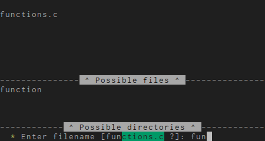
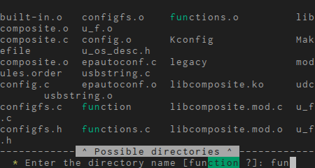
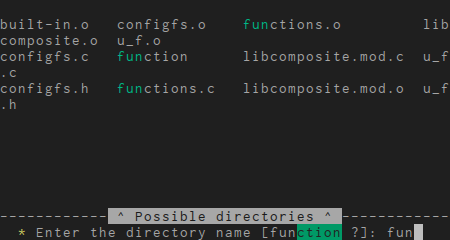
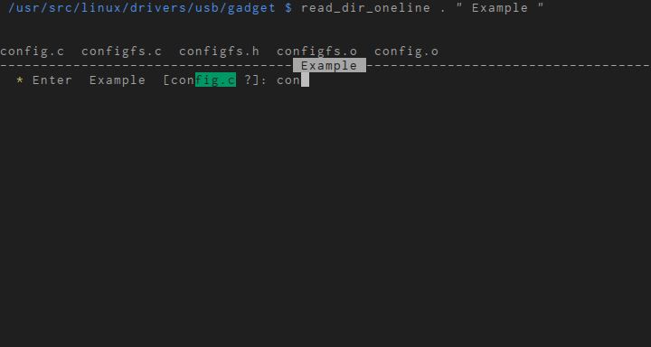

## SH Functions


This repository contains some files which are to be sourced by
[bash](https://www.gnu.org/software/bash/). The files contained are:

1. **my_dash_functions**: This file used to contain some functions which were
   used in some dash (POSIX) scripts I had. Currently, it simply contains
   some functions that are not used in most of my scripts. It is sourced
   by my_bash_functions.

2. **my_bash_functions**: This file contains some bash functions which are
   almost always used in my bash scripts. The important functions are:

   *centered_output*: This outputs some text centered on the terminal. If
   the text is greater than the terminal width, then it simply prints the
   text.

   *run_loop*: This outputs the text with a counter. The counter can go
   either up or down. The text should ideally be short enough to fit
   within the terminal width.

   *show_progress*: This function outputs a nice progress bar to the
   terminal. It accepts two lines at each increment of the progress bar.
   The first line should be any status message, and the second line
   a ratio given in the form count/total.

3. **my_read_files**: This file provides several different interactive bash
   prompts which acts like a file browser or directory browser. The output
   file or directory will be present in the environment variable `FILEPATH`
   after any of these functions exit. There are several such functions
   available:

   1. *read_filename*: This gives a listing of files and directories
      starting from the current directory. It will shortlist and highlight
      the files and/or directories that match the typed text. It is
      possible to traverse directories by entering the directory name or
      the beginning part of the directory name and then pressing `ENTER`.
      This function has the following syntax:

      ```
      read_filename <0|1> [<suffix>]
      ```

      where <0|1> must be specified to indicate whether `0`: only files are
      shown, or `1`: both files and directories are shown. The `suffix` is
      optional, and if specified, it will show only the file names with that
      particular suffix. If there is a file called `a.txt` and a directory
      called `a` then it is possible to go inside the directory by typing
      `a/` and pressing `ENTER`. To go to parent directory, type `..`.
      Screenshot for the command `read_filename 1 c`:
      

   2. *read_dirname*: This is a modified version of `read_filename` that
      provides files and directory listings only in the current directory.
      The names whose first part matches with the input text are
      highlighted. The syntax is:

      ```
      read_dirname [<dir>]
      ```

      where the `dir` argument is optional and if not provided.
      Screenshot for the command `read_dirname`:
      

   3. *read_dirname_short*: This is a modified version of `read_dirname`
      that displays only the shortlisted files and directories, whereas
      `read_dirname` displays all the files and directories and only
      highlights the shortlisted ones. Syntax is same as `read_dirname`.
      Screenshot for the command `read_dirname_short`:
      

   4. *read_dir_oneline*: This function lists the files and directories in
      the specified directory and optionally displays a help text. The
      files and directory displays are not separated unlike the other
      functions `read_filename`, `read_dirname`, and `read_dirname_short`.
      This function shows everything within 4 lines in the terminal, and it
      will show only the shortlisted files and directories. It is very
      useful when one does not want the displayed terminal history to be
      lost. The syntax is:

      ```
      read_dir_oneline <dir> [<help text>]
      ```

      where `dir` is the directory in which the files and directories
      should be displayed, and `help text` can be optionally provided that
      will be shown along with the input text.
      Screenshot for the command `read_dir_oneline . " Example "`:
      
